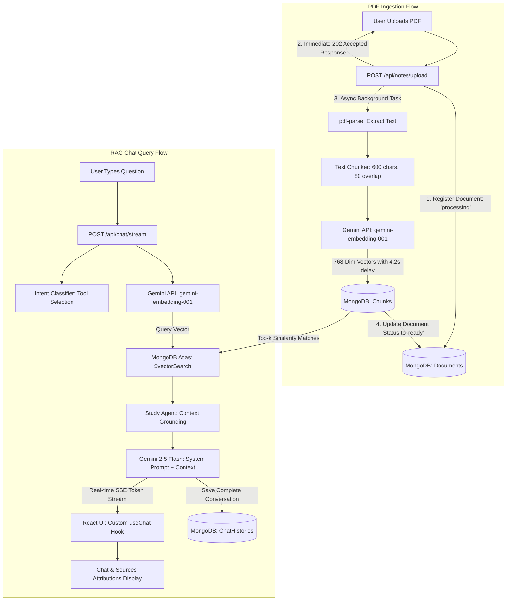

# Study Buddy — Agentic RAG Academic Assistant

Study Buddy is a professional full-stack MERN (MongoDB, Express, React, Node.js) web application integrated with Google Gemini to provide students with an intelligent, context-grounded AI academic study assistant. By uploading their PDF study notes, students can chat with an AI assistant that answers questions based **exclusively** on the uploaded documents. 

By leveraging Retrieval-Augmented Generation (RAG), Study Buddy grounds all answers in the student's raw uploaded data, prevents hallucinations, handles semantic source attributions, and preserves structured chat history sessions.

---

## 📸 Application Screenshots
*Use these placeholders to upload and show your application screenshots:*

### 🖥️ Student Dashboard (Document Upload & Management)
<!-- Space for student dashboard screenshot -->


### 💬 Chat Interface (Active Streaming & Source Attributions)
<!-- Space for chat interface screenshot -->


---

## 🚀 Key Features

* **Secure Authentication**: JWT-based user register, login, and profile authorization mapping.
* **Background Ingestion & PDF Parsing**: Async extraction of raw PDF text and chunking that doesn't block the UI threads.
* **Rate-Limit Guardrails**: Embedded exponential backoff and timed pauses to stay within the Gemini API free-tier limitations (15 requests/minute).
* **Intent-Based Agent Classification**: Pre-processes user inputs to select the most matching academic tool (`generate_quiz`, `summarize_document`, `explain_concept`, or `search_notes`).
* **Vector Semantic Search**: Matches user queries using MongoDB Atlas native Vector Search (Cosine Similarity) with strict ownership filters.
* **Real-time SSE Streaming**: Uses Server-Sent Events (SSE) to stream tokens dynamically from Gemini for a smooth, interactive UI typing animation.
* **Source Attributions**: Displays references, matching confidence percentages, and text excerpts beneath each response chunk.
* **Multi-Turn Chat History**: Restores previous chat history lists and sidebars for persistent conversational continuity.

---

## 🛠️ Technology Stack

| Layer | Technology | Role / Explanation |
| :--- | :--- | :--- |
| **Frontend** | React 18 + Vite + Tailwind CSS | High-performance Single Page Application client with responsive, modern UI/UX and real-time streaming displays. |
| **Backend** | Node.js + Express | Modular, controller-based REST API and Server-Sent Events (SSE) streaming server. |
| **Database** | MongoDB Atlas | Stores user records, document metadata, chat histories, and dense vector embeddings. |
| **Vector Search**| MongoDB Atlas Vector Search | Built-in Approximate Nearest Neighbor (ANN) index utilizing Cosine Similarity. |
| **Embedding API**| Gemini `gemini-embedding-001` | Generates 768-dimensional dense vectors from text chunks. |
| **LLM Inference** | Gemini `gemini-2.5-flash` | Multi-turn reasoning, intent classification, and streaming text generation. |
| **Parsing & Files**| `pdf-parse` + `multer` | Extracts raw PDF text from binary streams and manages multipart file uploads. |

---

## 🧠 System Architecture

The following diagram details the end-to-end data flow for both the **Ingestion Pipeline** (when uploading documents) and the **Retrieval & Generation Pipeline** (when chatting with the assistant):



### Directory Structure

```
study-buddy/
├── server/
│   ├── server.js                  # Express server bootstrapper & global config
│   ├── config/
│   │   └── db.js                  # Database connection utility
│   ├── controllers/
│   │   ├── authController.js      # User registration, login, and profiles
│   │   ├── chatController.js      # Chat histories, list sessions, and SSE streams
│   │   └── notesController.js     # PDF upload, retrieve notes, and file removals
│   ├── middleware/
│   │   ├── auth.js                # JWT token validation middleware
│   │   ├── errorHandler.js        # Custom AppError and centralized handler
│   │   └── upload.js              # Multer configuration and file constraints
│   ├── models/
│   │   ├── Chunk.js               # Embedding chunks mongoose schema
│   │   ├── Document.js            # Uploaded document metadata schema
│   │   └── User.js                # Users and ChatHistory schema structures
│   ├── routes/
│   │   ├── auth.js                # Authentication endpoints mapping
│   │   ├── chat.js                # Chat session and stream endpoints mapping
│   │   └── notes.js               # PDF notes endpoints mapping
│   └── utils/
│       ├── ingestion.js           # PDF parsing, sliding window chunking, & embeddings
│       ├── studyAgent.js          # Intent routing & system prompt assembly
│       └── vectorSearch.js        # MongoDB Atlas Vector Search pipelines
│
└── client/
    ├── src/
    │   ├── App.jsx                # SPA routing and context wrappers
    │   ├── hooks/
    │   │   └── useChat.js         # Custom hook managing SSE streams & abort limits
    │   ├── pages/
    │   │   ├── LoginPage.jsx      # Login UI page
    │   │   ├── RegisterPage.jsx   # Signup UI page
    │   │   ├── DashboardPage.jsx  # Notes list & file upload dashboard
    │   │   └── ChatPage.jsx       # Side-by-side stream & session sidebar
    │   └── utils/
    │       └── api.jsx            # Axios intercepts configuration
    └── index.css                  # Global CSS variables & UI styles
```

---

## 🧠 RAG Pipeline Architecture & Mechanics

Retrieval-Augmented Generation (RAG) updates the knowledge base of an LLM by injecting relevant text segments retrieved from a database directly into the system instructions before generation.

### 1. Ingestion Phase
1. **Upload Acceptance**: A PDF is uploaded (`multer` disk-storage). The backend saves a database document record with status `'processing'` and returns a `202 Accepted` status to the frontend.
2. **Text Extraction**: The backend reads the uploaded file buffer asynchronously, parsing it using `pdf-parse`.
3. **Text Chunking**: The raw text is cleaned and sliced into chunks of **600 characters** with a sliding **80-character overlap** to ensure semantic continuity at chunk borders.
4. **Rate-Limited Vectorization**: Each text chunk is sent to Gemini's `gemini-embedding-001` model to return a 768-dimensional float representation. To respect Gemini's free tier rate limits (15 RPM), the ingestion loop pauses for **4.2 seconds** between chunks and includes exponential backoff.
5. **Database Storage**: The chunks, vectors, parent document reference, user ownership keys, and metadata are saved in the `chunks` collection in MongoDB. Once complete, the parent document's status transitions to `'ready'`.

### 2. Retrieval & Generation Phase
1. **Intent Classification**: The query is classified by `studyAgent.js` to assign a target prompt task (`generate_quiz`, `summarize_document`, `explain_concept`, or `search_notes`).
2. **Query Vectorization**: The student's question is embedded into a 768-dimensional vector.
3. **Vector Search Query**: An aggregation pipeline runs inside MongoDB Atlas using `$vectorSearch`:
   - It performs an approximate nearest neighbor search via **cosine similarity**.
   - It applies pre-filters on `userId` and `documentId` to prevent unauthorized cross-user queries.
   - It discards chunks with scores below `0.5` to eliminate noise.
4. **Context Grounding**: Top matching text chunks are formatted as source inputs. The system prompt instructs Gemini: *"Answer the student's question ONLY using the provided source chunks. If the answer is not present, respond with: 'I couldn't find this in your notes.'"*
5. **SSE Token Streaming**: Express establishes a Server-Sent Events connection (`text/event-stream`). Gemini's `sendMessageStream` feeds tokens back, which are piped directly to the user's React client.
6. **Chat Persistence**: The exchange is logged inside the `ChatHistory` database for multi-turn coherence.

---

## 📡 API Endpoints

### 🔐 Authentication (`/api/auth`)
| Route | Method | Access | Description |
| :--- | :--- | :--- | :--- |
| `/register` | POST | Public | Creates a new user account & returns a JWT token. |
| `/login` | POST | Public | Authenticates user credentials & returns a JWT token. |
| `/me` | GET | Private | Retrieves the profile details of the logged-in user. |

### 📄 Notes & Documents (`/api/notes`)
| Route | Method | Access | Description |
| :--- | :--- | :--- | :--- |
| `/upload` | POST | Private | Uploads a PDF note (`multipart/form-data`) and starts background ingestion. |
| `/` | GET | Private | Lists all uploaded documents owned by the logged-in user. |
| `/:id` | GET | Private | Retrieves metadata and status details for a specific document. |
| `/:id` | DELETE | Private | Deletes the document from disk and purges all related database chunks. |

### 💬 Chat (`/api/chat`)
| Route | Method | Access | Description |
| :--- | :--- | :--- | :--- |
| `/stream` | POST | Private | Streams Gemini's context-grounded response via SSE. |
| `/sessions` | GET | Private | Lists the titles and session IDs of the user's last 20 chat conversations. |
| `/history/:sessionId` | GET | Private | Retrieves the complete message history for a specific chat session. |
| `/history/:sessionId` | DELETE | Private | Clears the message history and details of a specific chat session. |

---

## ⚙️ Setup & Installation

### 1. Clone and Install Dependencies
```bash
git clone <your-repo-url>
cd study-buddy
npm run install:all
```

### 2. Configure Environment Variables
Create a `.env` file in the `/server` directory:
```env
PORT=5000
MONGODB_URI=mongodb+srv://<username>:<password>@<cluster>.mongodb.net/study-buddy
GEMINI_API_KEY=your_gemini_api_key_here
JWT_SECRET=your_jwt_secret_key_here
VECTOR_INDEX_NAME=vector_index
```

### 3. Create MongoDB Atlas Vector Search Index
For similarity search queries to succeed, you must register a Vector index in Atlas:
1. Go to your collection inside **MongoDB Atlas**.
2. Navigate to **Atlas Search** -> **Create Search Index** -> **Atlas Vector Search (JSON Editor)**.
3. Select the `study-buddy` database and the `chunks` collection.
4. Input the index details:
```json
{
  "fields": [
    {
      "type": "vector",
      "path": "embedding",
      "numDimensions": 768,
      "similarity": "cosine"
    },
    {
      "type": "filter",
      "path": "userId"
    },
    {
      "type": "filter",
      "path": "documentId"
    }
  ]
}
```
5. Name the index `vector_index` and click **Create Search Index**.

### 4. Running the Project Locally
Run the concurrent dev command from the root directory:
```bash
npm run dev
```
* **Frontend client**: `http://localhost:5173`
* **Backend server**: `http://localhost:5000`
